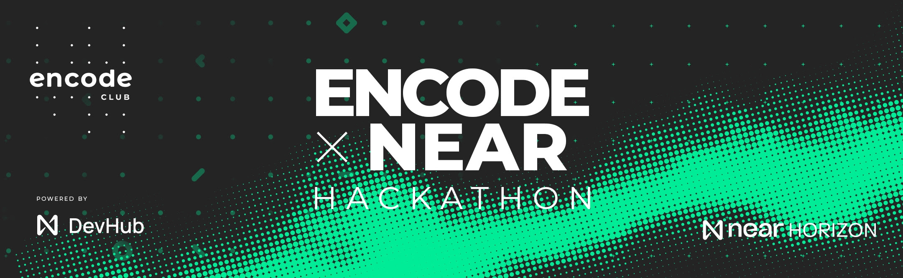

# Encode x NEAR Horizon Hackathon

## Friend.tech Account Explorer 🔍
Friend.tech Account Explorer is a powerful **BOS component** designed for the NEAR Horizon Hackathon that empowers users to dive deep into the friend.tech smart contract. With this tool, users can effortlessly explore the friend.tech ecosystem, gaining valuable insights into the dynamics of the network.

## Key Features:
+ 💡 **Supply Details**: Easily access information about the total supply of shares associated with a specific address.

+ 💰 **Buy and Sell Prices**: Get real-time data on buy and sell prices for shares at the chosen address, enabling users to make informed decisions.

+ 🔄 **Transparent Fee Calculations**: Understand the buy and sell prices after accounting for transaction fees, providing a clear picture of actual costs.

+ 🏠 **Address Balance**: Quickly check the balance of an address to stay updated on account health and wealth.

.png>)

## Demo Video

## Getting Started

1. Go to [NEAR Components](https://near.org/components).

2. Search for `friend.tech-explorer` and click on the component to open it.

## About the Hackathon

[Encode x NEAR Horizon Hackathon](https://www.encode.club/encode-near-horizon-hackathon)
Powered by DevHub
A 4-week hackathon centred around building on NEAR Protocol as a part of the NEAR Horizon initiative to support builders.